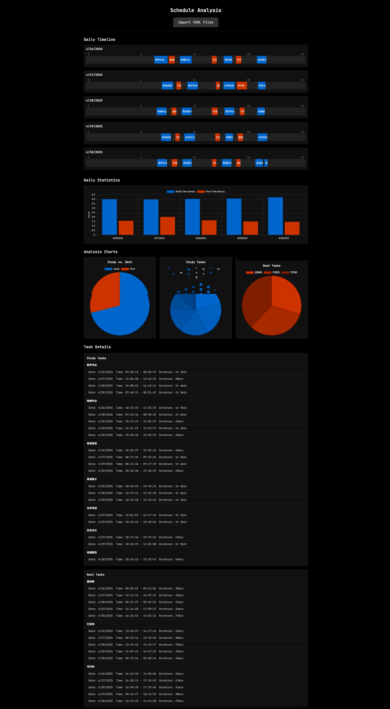

## 时间显示

鼠标移动到页面底部，可以看到一个工具栏。
- 调整中间的输入框切换时区，默认为 UTF+8。  
  *detail*: 可以输入 +/- 和数字。如果把更改字符串 $\texttt{UTF}$，则会自动回到默认的 UTF+8。
- 按下左边的小时制按钮可以切换 12h/24h。
- 按下右边的模式切换按钮可以在三种显示模式中切换：显示到分钟、显示到秒（默认）、显示到毫秒（*detail*: 右上角以小字体呈现）。

## 倒计时

### 主界面选择时间

- 在主界面，可以按下默认的按钮，快速开始倒计时。默认的倒计时时间分别是：10 min、30 min、45 min、1 h、2 h。
- 也可以在下方的输入框中输入数字，自定义倒计时时间。按下回车或 Start 按钮进入倒计时页面。  
  *detail*: 如果没有输入内容，Start 按钮处于灰色的禁止点击状态，如果按下回车试图进入倒计时，顶部会提示“please input a valid number to start”且不会进入倒计时模式。

### 倒计时页面

**控制：**

- 按下 Pause 按钮后，倒计时停止（*detail*: 时钟会变成橙色表示暂停）。  
  再次按下 Continue 按钮，倒计时继续。
- 在任意情况下按下 End 按钮，结束倒计时，回到主界面。

**显示：**

- 根据倒计时时间，预计结束时间，并显示在时钟上方。（*detail*: 倒计时暂停时将改为橙色，并且持续更新预计结束的时间）
- 根据剩余时间，页面顶部有一个橙色的进度条。（*detail*: 倒计时暂停时显示为灰色）
- 倒计时结束后，计时器会变成红色并闪烁停留 6 秒，同时，浏览器也会发送通知，告知用户设定的几分钟的计时器结束。

*detail*: 如果剩余时间小于一小时，时钟会自动隐藏小时的显示。

## 计时器

- 在未计时模式下，按下 Start 开始计时。  
  按下 Pause 按钮后，计时器停止。（*detail*: 时钟会变成橙色表示暂停）  
  再次按下 Continue 按钮，计时器继续。
- 在任意情况下按下 End 按钮，结束计时器，返回默认的未计时模式。

## 日程

- 上半部分包含 [时间显示](#时间显示)、[倒计时](#倒计时)、[计时器](#计时器) 三个模块，通过点击最上方的按钮切换。便于在显示日程页面的同时使用其他模块。
- 下半部分包括：任务和时间线。
  - 任务：制定任务和展示任务。
    - 制定任务：输入任务名称、选择任务类型（学习或休息），并点击开始。
    - 展示任务：最左侧展示任务用时，最后侧展示任务名称和类型，以及一个结束按钮，点击结束任务。
  - 时间线：在时间线上查看今日学习和休息任务，包括实时预览正在进行中的任务。
- 右下角包括清除数据按钮和导出按钮，可以导出并在 [分析](#分析) 页面中进行分析。

*detail*: 数据存储在本地，不随页面的刷新或浏览器的关闭而消失。

## 分析

- 主界面包含一个导入按钮，点击后可以导入一个或多个YAML格式的日程记录文件（格式需符合日程模块导出的YAML格式）。
- 导入后，页面会按照日期从上到下显示每日的时间线，直观展示每天的活动安排。
- 时间线下方显示每日学习和休息时间统计的柱形图，可以直观比较不同日期的时间分配。
- 柱形图下方显示三个饼图分析：
  - 学习和休息时间占比
  - 不同学习任务的时间占比（按任务名称分类）
  - 不同休息任务的时间占比（按任务名称分类）
- 最下方按照任务名称分类，分别列出每一个学习任务和休息任务的详细记录，包括日期、时间和持续时长。

## overall

*detail*: 主题统一，特殊颜色（如橙色、红色）在不同页面也统一。整体为黑色背景模式，利于屏幕持续显示时间。  
*detail*: 基于全屏网页设计，对于不同大小尺寸的屏幕都能够适应。  
*detail*: 兼容不同浏览器和内核，专门针对 Chrome、Safari、Firefox 特殊开发，并在 Chrome、Safari、Firefox、Edge、Opera、IE 中进行了测试。

## repository

Under the [MIT license](LICENSE). (c) 2025 NailFec
